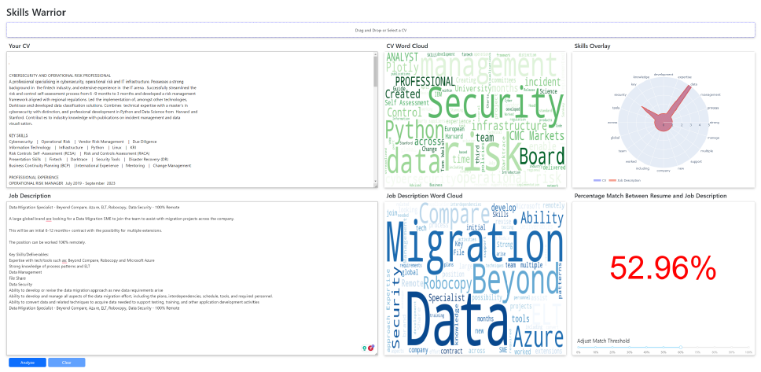

This project is to create a  dash application that allows a user to upload or drag and drop both a CV and a job decription into the interface. It will then match skills on the CV and skills in the Job description.

One of the outputs will be a radar graph showing how the Applicant CV matches the Job Description.

Future tasks might include:

1. Provide a similarity score as a percentage of how good a match particular match a CV is to a Job Description.

2. Provide a list of skills that are missing from the CV that are in the Job Description.

3. Provide a list of skills that are missing from the Job Description that are in the CV.

4. Provide a list of skills that are in both the CV and the Job Description.

5. Create a database of CVs and Job Descriptions that can be used to train a machine learning model to match CVs to Job Descriptions.

Added in some scikit-learn vectorisation so now the Percentage figure is an accurate reflection between the CV and JD.

